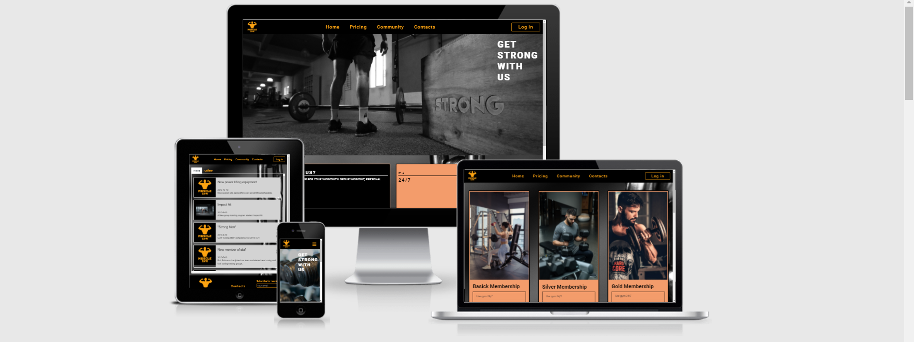
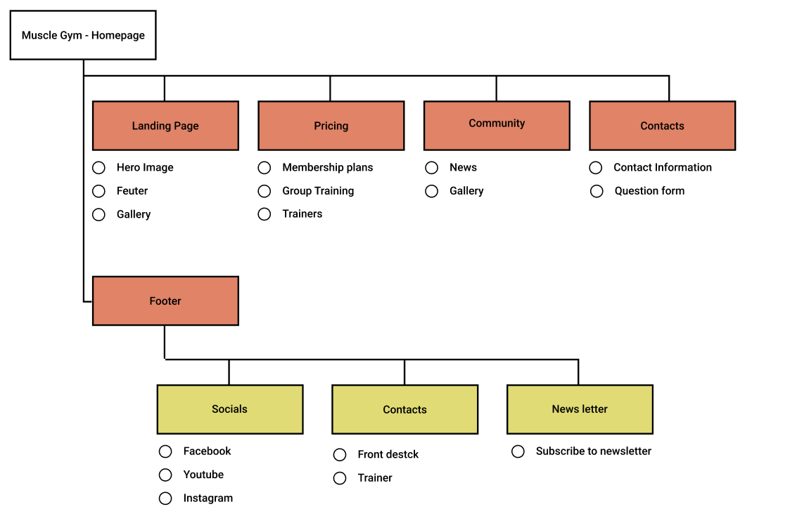

# Muscle Gym



[View the live project here](https://perkunaskf.github.io/muscle-gym/)

## Table of contents
1. [Introduction](#Introduction)
2. [UX](#UX)
    1. [Ideal User Demographic](#Ideal-User-Demographic)
    2. [User Stories](#User-Stories)
    3. [Development Planes](#Development-Planes)
    4. [Design](#Design)
3. [Features](#Features)
    1. [Design Features](#Design-Features) 
    2. [Existing Features](#Existing-Features)
    3. [Futer Features](#Futer-Features)
4. [Issues and Bugs](#Issues-and-Bugs)
5. [Technologies Used](#Technologies-Used)
     1. [Main Languages Used](#Main-Languages-Used)
     2. [Frameworks, Libraries & Programs Used](#Frameworks,-Libraries-&-Programs-Used)
6. [Testing](#Testing)
     1. [Testing.md](TESTING.md)
7. [Deployment](#Deployment)
     1. [Deploying on GitHub Pages](#Deploying-on-GitHub-Pages)
     2. [Forking the Repository](#Forking-the-Repository)
     3. [Creating a Clone](#Creating-a-Clone)
8. [Credits](#Credits)
     1. [Media](#Media)
     2. [Code](#Code)
***

## Introduction

This website was designed for a fictional gym, "Muscle Gym". The purpose of this website was to establish an online presents for new, current clients to find out relevant information about the gym ant it's offering services.

This is the first Milestone Project from necessary for the project to complete the Full Stack Web Development Program at The Code Institute.

The main requirement was to make a static and a responsive website with minimum three pages using primarily **HTML** and **CSS3**.

[Back to top ⇧](#Muscle-Gym)

## UX

### Ideal User Demographic
#### The ideal user of this website is:
- New/potential clients
- Current clients

### User Stories
#### New/Potential clients:
1. As a new client, I want to easily navigate through the website to find the relevant content, effortlessly.
2. As a new client, I want to learn more about the gym in order to know if it can supply me with desired services.
3. As a new client, I want to easily navigate to the gym's social links in order to keep up with the latest news and events.
4. As a new client, I want to be able to see gym's photos so I could evaluate equipment used.

#### Current Clients Goals:
1. As a current client, I want to easily find out about upcoming events so I can book a place.
2. As a current client, I want to find out about new services that the gym provides.
3. As a current client, I want to easily log in to my membership account to manage my membership.

### Development Planes

In order to create a comprehensive and informative website, the developer gathered information from social forums to add required functionality to the site and how would it answer user stories, as described above.

#### Strategy

Broken into three categories.
The website will focus on the following target audience:
- **Roles:**
     - Current clients of Muscle Gym
     - New clients of Muscle Gym

- **Demographic:**
     - 16 and plus year olds
     - People with rigid time schedules

The website needs to enable the **user** to:
- Retrieve desired information:
     - Gym opening and closing overs
     - Membership plans and prices
     - Upcoming events
     - Contact information
     - Get information about possible services

The website needs to enable the **Gym** to:
- Develop an online presence 
- Provide an easily navigable website for users to find relevant information

#### Scope
A scope was defined in order to clearly identify what needed to be done in order to align features with the strategy previously defined.
- **Content Requirements**
     - The user will be looking for:
          - Gym membership plans and price
          - News about the gym and events
          - Possible gym services
          - Contact details
          - Social Links
- **Functionality Requirements**
     - The user will be able to:
          - Easily navigate through the site in order to find the information they want
          - Contact Gym staff for any raised question
          - Get the latest news about the gym's events and new services

#### Structure
The information architecture was organized in a **hierarchial tree structure** in order to ensure that users could navigate through the site with ease and efficiency.



#### Skeleton 
Wireframe mockups were created in a [Figma Workspace](https://www.figma.com/file/Wd7fHpgJvJui9r4ixh1Xaz/Muscle-Gym?node-id=0%3A1)

### Design

#### Colour Scheme
The main colors used are a mixture of black, orange, grey and white.

#### Typography
Font [Roboto](https://fonts.google.com/specimen/Roboto "Link to Roboto Google font") is used, throughout the website with Sans Serif as the fallback font.

#### Imagery
Images were provided from [Pexels](https://www.pexels.com/) All credits are given to respective image authors credited before the image in the code.

Logo images were created on [Free logo design](https://www.freelogodesign.org/).

[Back to top ⇧](#Muscle-Gym)

## Features

### Design Features
Each page of the website features a consistent responsive navigational system:
- The **Navigation bar** is fixed to the top of the page so the user can always use the navigation links.
- The **Logo** in the top left corner on the click will redirect the user to the home page.
- All navigation links (Home, pricing, community and contacts) disappear on smaller screen sizes and a **toggler** icon will appear with a drop down menu for all navigation links and a **Log in* button.
- The footer contains a **Logo** image witch after clicking will redirect the user to the home page, **social media icons** will redirect user to the respective social media pages.
- The footer contains **Contacts** button, witch after clicking drops down a menu with navigation to the front desk and trainer contact.
- The footer contains **subscribe for newsleter** forum, after uses submits their email they will be notified about news and events at the gym.

<dl>
    <dt><a href="index.html" target="_blank" alt="Muscle Gym Home Page">Home Page</a></dt>
    <dd>
        <ul>
            <li>
                <strong>Hero Image</strong> - Occupying 100% of the page width, on the right side there is cover text. On smaller screens the image changes from the desktop image (Man with a barbell) to a dumbbell rack. The images were chosen because they give a neutral feel to the gym so to appeal to a wider rage of the people.
            </li>
            <li>
                <strong>Feuter section</strong> - Occupies 95% of the page width. The section is divided into title container and feauter containers. The title container is styled differently to separate from the feature and feature containers have a brief description of the gym's services and features. On smaller screens this feature containers is fitted into a carousel so not to occupy too much space.
            </li>
        </ul>
    </dd>
</dl>

<dl>
    <dt><a href="pricing.html" target="_blank" alt="Muscle Gym Pricing Page">Pricing Page</a></dt>
    <dd>
        <ul>
            <li>
                <strong>Membership plans</strong> - The section is divided to three separate cards witch have their own images. Under every card there is a list of the features of the membership plan and the price. On smaller screens the cards become staked.
            </li>
            <li>
                <strong>Group training</strong> - Contains of title container and group container. Title container is stylistically different to separate from the group containers. Every group container has a name of the group training program and a background image to represent the name of the group training program. On smaller screens containers are fitted into a carousel so not to occupy too much space on the screen.
            </li>
            <li>
                <strong>Trainers</strong> - Section consists of the navigation bar and a card. The navigation bar consists of the trainer name and on focus the background and font color changes to indicate on which car the user is located. The card changes depending on the witch navigation link were chosen. Card consist of the trainers profile picture, description and footer with the trainer's contact information. The profile picture is on the left, description on the right and the footer on the bottom of the description. On smaller screen card component become staked, profile picture on top, description in the middle and footer at the bottom.
            </li>
        </ul>
    </dd>
</dl>

<dl>
    <dt><a href="community.html" target="_blank" alt="Muscle Gym Community Page">Community Page</a></dt>
    <dd>
        <ul>
            <li>
                <strong>Page division</strong> - Section is divaded in to navigation bar and the contant container. The navigation bar has **News** and **Gallery** links. This links change backgraound color and forn color on focus so user can indedify on witch section of the content tehy are.
            </li>
            <li>
                <strong>News</strong> - The container is made in the overflow container so don't feel the entire page with news. News are divided with cards. Cards are composed of two pats image and description. The images are located on the left and description on the right. On smaller screens cards become State: image moves to the top and description goes to the bottoms. All events and news relating only with the gym are marked with gym logo and anything that are related outside the gym or
            <li>
                <strong>Gallary</strong> - All images are displayed in their original aspect ration. And fitted in four columns. On the small screen sizes, images are stacked.
            </li>
        </ul>
    </dd>
</dl>

<dl>
    <dt><a href="contacts.html" target="_blank" alt="Muscle Gym Contacts Page">Contacts Page</a></dt>
    <dd>
        <ul>
            <li>
                <strong>Contact information</strong> - This section has gym's address, phone number and email. The title is separated with a bottom border and font color is white so to define it from the background image. On smaller screen content becomes staked.
            </li>
            <li>
                <strong>Google map location</strong> - Add a responsive google map location container. The location is fiction and not real for the gym. On smaller screen content becomes staked.
            </li>
            <li>
                <strong>Question form</strong> - The form consists of title, text submission container, email submission container and a submission button. Containers are lined with orange border and background is transparent on focus the background becomes black and font color white so to clearly separate the two. On hover the button changes background color and font color. On smaller screen content becomes staked.
            </li>
        </ul>
    </dd>
</dl>

### Existing Features
- **Header Logoo** - Appears on every page for brand recognition. On hover a round frame appears and on click redirect the user to the home page.
- **Header Navigation Bar** - Appears on every page and is fixed to the top of the page so the user can easily navigate true website's pages.
- **Log In Button** - On hover changes back ground and font color.
- **Toggler** - Replaces the navigation bar links on smaller screens and features a drop down menu on click to all the links and the **Log In** button.
- **Footer Logo** - On hover a round frame appears and on click redirect the user to the home page.
- **Media Social Links** - On hover changes background and font color. On click opens a new tab to selected social media.
- **Contacts Button** - On hover an orange frame appears. On click a drop down menu appears with link to redirect the user to the **Front desk** (content page) or **Trainer** contact information.
- **Newsletter Form** - Email input on focus changes border color to white and text font color to white. Subscribe button changes background color and font color on hover and click. Email input is necessary.
- **Feature carousel** - Appears on smaller screens. Fits all the feature on the home page and allows users to scroll thru them. If not, control features scroll them self.
- **Group Trainin carousel** - Appear on smaller screens. Fits all group training programs on the pricing page and allows users to scroll thru them. If not, control programs scroll them self.
- **Google Map** - The map shows, gym location (location is fictional) and is fully responsive.

### Futer Features
This feuter were not implemented becose of lack of time:
- **Gym Featuers** - Add more information with a pop up content holder for the home page's features sections.
- **Schedule Page** - For group training section, adding link with a redirection to an extra page with schedule for group training sessions.
- **Group Training Info** - Add more information with a pop up content holder for the training group section in the pricing page.

[Back to top ⇧](#Muscle-Gym)

## Issues and Bugs 

### Commit History

During development, developer made "git commit" comment after finishing major blocks of the website (eg. header, footer, page or its contents). The developer was not aware that it had to be done after every detail add. This was only pointed out after the first developing meeting with the mentor. At that point majority of website was finished and only few bugs were left to fix and write the **README** and **TESTING** files. Regarding the repeating messages in commit history of **README** and **TESTING** files, those files were edited in **github** and not in **gitpod** and the developer was not aware that they will appear to commit history.
After this issue was pointed out to the developer, deloper started adding commits after smaller eddies of the project.

Noteworthy list of issues encountered during development.

**Nav Bar Stiky Bug** - During development issue occur when trying to implement sticky to top feature to the navigation bar. The navigation bar would only be sticky for a part of the page and then stop. The solution was found on [W3schools](https://www.w3schools.com/howto/howto_js_navbar_sticky.asp "Link to w3schools sticky navigation explanationn"). After reading true the explanation and having the code the problem was that the sticky navigation stick to a particular section so the solution was to make a section for the entire page except the footer and add sticky feature to the header.

**Footer Not Always On The Bottom Bug** - During development issue occur where at shorter pages the footer would not be at the bottom and there would be a blank space. A solution was found on [Stackoverflow](https://stackoverflow.com/questions/643879/css-to-make-html-page-footer-stay-at-bottom-of-the-page-with-a-minimum-height-b). By editing the section of a sticky navigation container to making it be 100% in height it made the page load on the entire screen height.

**Feature Container Alignment Bug** - During development feature alignment cause problems: whenever increasing the distends between each feature the food container would stack under the other three. Using **Bootstrap** .col class the columns would be divide early true the spaces, but whenever increasing the margin the columns would not behave as wanted. A solution was instead of increasing the morning to put every column, int to another column and use the **Bootstrap** provade gutters as the wanted spaces.

**Trainer Profile Picture Not Fitting Bug** - When applying the image to the trainer profile card the image would be too big and take up all the space of the screen. If tried to make the image smaller the image will be destroyed. Setting it up as a background image would make it be cut off and not the one-year image would be usable. The salute was found on [Stack Overflow](https://stackoverflow.com/questions/3029422/how-do-i-auto-resize-an-image-to-fit-a-div-container "Image fitting to a container solution"). Soliution was to make image have max with and max height.

**Question Formu Background Color Bug** - After selecting the forum and inputting text background for mum's container would change color to black, but after not forcing it would go back to transparent. The solution was to add a focus subclass in style.css.

[Back to top ⇧](#Muscle-Gym)

## Technologies Used
### Main Languages Used
- [HTML5](https://en.wikipedia.org/wiki/HTML5 "Link to HTML Wiki")
- [CSS3](https://en.wikipedia.org/wiki/Cascading_Style_Sheets "Link to CSS Wiki")

### Frameworks, Libraries & Programs Used
- [Bootstrap 4.6](https://getbootstrap.com/docs/4.6/getting-started/introduction/)
    - Bootstrap was used to implement the responsiveness of the site, using bootstrap classes.
- [Google Fonts](https://fonts.google.com/ "Link to Google Fonts")
    - Google fonts was used to import the fonts "Roboto".
- [Font Awesome](https://fontawesome.com/ "Link to FontAwesome")
     - Font Awesome was used on all pages throughout the website to import icons (e.g. social media icons) for UX purposes.
- [Git](https://git-scm.com/ "Link to Git homepage")
     - Git was used for version control by utilizing the GitPod terminal to commit to Git and push to GitHub.
- [GitHub](https://github.com/ "Link to GitHub")
     - GitHub was used to store the project after pushing
- [Figma](https://www.figma.com/ "Link to Figma homepage")
     - Figma was used to create the wireframes during the design phase of the project.
- [Am I Responsive?](http://ami.responsivedesign.is/# "Link to Am I Responsive Homepage")
     - Am I Responsive was used in order to see responsive design throughout the process and to generate mockup imagery to be used.

[Back to top ⇧](#Muscle-Gym)

## Testing

Testing information can be found in a separate testing [file](TESTING.md "Link to testing file")

## Deployment

This project was developed using [Git Hub](https://github.com/ "Git Hub site").

### Deploying on GitHub Pages
To deploy this page to GitHub Pages from its GitHub repository, the following steps were taken:

1. Log into [GitHub](https://github.com/login "Link to GitHub login page") or [create an account](https://github.com/join "Link to GitHub create account page").
2. Locate the [GitHub Repository](https://github.com/rebeccatraceyt/KryanLive "Link to GitHub Repo").
3. At the top of the repository, select Settings from the menu items.
4. Scroll down the Settings page to the "GitHub Pages" section.
5. Under "Source" click the drop-down menu labelled "None" and select "Master Branch".
6. Upon selection, the page will automatically refresh meaning that the website is now deployed.
7. Scroll back down to the "GitHub Pages" section to retrieve the deployed link.
8. At the time of submitting this Milestone project the Development Branch and Master Branch are identical.

### Forking the Repository
By forking the GitHub Repository we make a copy of the original repository on our GitHub account to view and/or make changes without affecting the original repository by using the following steps...

1. Log into [GitHub](https://github.com/login "Link to GitHub login page") or [create an account](https://github.com/join "Link to GitHub create account page").
2. Locate the [GitHub Repository](https://github.com/rebeccatraceyt/KryanLive "Link to GitHub Repo").
3. At the top of the repository, on the right side of the page, select "Fork"
4. You should now have a copy of the original repository in your GitHub account.

### Creating a Clone
How to run this project locally:
1. Install the [GitPod Browser](https://www.gitpod.io/docs/browser-extension/ "Link to Gitpod Browser extension download") Extension for Chrome.
2. After installation, restart the browser.
3. Log into [GitHub](https://github.com/login "Link to GitHub login page") or [create an account](https://github.com/join "Link to GitHub create account page").
2. Locate the [GitHub Repository](https://github.com/rebeccatraceyt/KryanLive "Link to GitHub Repo").
5. Click the green "GitPod" button in the top right corner of the repository.
This will trigger a new gitPod workspace to be created from the code in github where you can work locally.

How to run this project within a local IDE, such as VSCode:

1. Log into [GitHub](https://github.com/login "Link to GitHub login page") or [create an account](https://github.com/join "Link to GitHub create account page").
2. Locate the [GitHub Repository](https://github.com/rebeccatraceyt/KryanLive "Link to GitHub Repo").
3. Under the repository name, click "Clone or download".
4. In the Clone with HTTPs section, copy the clone URL for the repository.
5. In your local IDE open the terminal.
6. Change the current working directory to the location where you want the cloned directory to be made.
7. Type 'git clone', and then paste the URL you copied in Step 3.
```
git clone https://github.com/USERNAME/REPOSITORY
```
8. Press Enter. Your local clone will be created.

Further reading and troubleshooting on cloning a repository from GitHub [here](https://docs.github.com/en/free-pro-team@latest/github/creating-cloning-and-archiving-repositories/cloning-a-repository "Link to GitHub troubleshooting")

[Back to top ⇧](#Muscle-Gym)

## Credits 

### Media
- All photographic images were used for [Pexels](https://www.pexels.com/ "Link to Pexel Home page"). All credits to image authors are written before the image.
- All logo images were made on [Free logo design](https://www.freelogodesign.org/).

### Code
To better understand the code that was being implemented many sites were used if the code was copied it was made shared that it would be referenced in the code. This site was used on a frequent basis:
- [Stack Overflow](https://stackoverflow.com/ "Link to Stack Overflow page")
- [W3Schools](https://www.w3schools.com/ "Link to W3Schools page")
- [Bootstrap](https://getbootstrap.com/ "Link to BootStrap page")

[Back to top ⇧](#Muscle-Gym)
