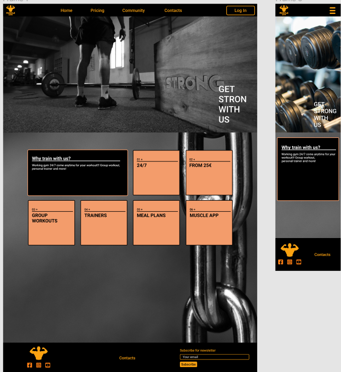

# Muscle Gym

[View the live project here](https://perkunaskf.github.io/muscle-gym/)

##Table of contents
1. [Introduction](#Introduction)
2. [UX](#UX)
    1. [Ideal User Demographic](#Ideal-User-Demographic)
    2. [User Stories](#User-Stories)
    3. [Development Planes](#Development-Planes)
    4. [Design](#Design)
3. [Features](#Features)
    1. [Design Features](#Design-Features) 
    2. [Existing Features](#Existing-Features)
    3. [Features to Implement in the future](#Features-to-Implement-in-the-future)
4. [Issues and Bugs](#Issues-and-Bugs)
5. [Technologies Used](#Technologies-Used)
     1. [Main Languages Used](#Main-Languages-Used)
     2. [Additional Languages Used](#Additional-Languages-Used)
     3. [Frameworks, Libraries & Programs Used](#Frameworks,-Libraries-&-Programs-Used)
6. [Testing](#Testing)
     1. [Testing.md](TESTING.md)
7. [Deployment](#Deployment)
     1. [Deploying on GitHub Pages](#Deploying-on-GitHub-Pages)
     2. [Forking the Repository](#Forking-the-Repository)
     3. [Creating a Clone](#Creating-a-Clone)
8. [Credits](#Credits)
     1. [Content](#Content)
     2. [Media](#Media)
     3. [Code](#Code)
9. [Acknowledgements](#Acknowledgements)
***

## Introduction

This website was designed for a fictional gym, "Muscle Gym". The purpose of this website was to establish an online presents for new, current clients to find out relevant information about the gym ant it's offering services.

This is the first Milestone Project from necessary for the project to complete the Full Stack Web Development Program at The Code Institute.

The main requirement was to make a static and a responsive website with minimum three pages using primarily **HTML** and **CSS3**.

[Back to top ⇧](#Muscle-Gym)

## UX

### Ideal User Demographic
#### The ideal user of this website is:
- New/potential clients
- Current clients

### User Stories
#### New/Potential clients:
1. As a new client, I want to easily navigate through the website to find the relevant content, effortlessly.
2. As a new client, I want to learn more about the gym in order to know if it can supply me with desired services.
3. As a new client, I want to easily navigate to the gym's social links in order to keep up with the latest news and events.
4. As a new client, I want to be able to see gym's photos so I could evaluate equipment used.

#### Current Clients Goals:
1. As a current client, I want to easily find out about upcoming events so I can book a place.
2. As a current client, I want to find out about new services that the gym provides.
3. As a current client, I want to easily log in to my membership account to manage my membership.

### Development Planes

In order to create a comprehensive and informative website, the developer gathered information from social forums to add required functionality to the site and how would it answer user stories, as described above.

#### Strategy

Broken into three categories.
The website will focus on the following target audience:
- **Roles:**
     - Current clients of Muscle Gym
     - New clients of Muscle Gym

- **Demographic:**
     - 16 and plus year olds
     - People with rigid time schedules

The website needs to enable the **user** to:
- Retrieve desired information:
     - Gym opening and closing overs
     - Membership plans and prices
     - Upcoming events
     - Contact information
     - Get information about possible services

The website needs to enable the **Gym** to:
- Develop an online presence 
- Provide an easily navigable website for users to find relevant information

#### Scope
A scope was defined in order to clearly identify what needed to be done in order to align features with the strategy previously defined.
- **Content Requirements**
     - The user will be looking for:
          - Gym membership plans and price
          - News about the gym and events
          - Possible gym services
          - Contact details
          - Social Links
- **Functionality Requirements**
     - The user will be able to:
          - Easily navigate through the site in order to find the information they want
          - Contact Gym staff for any raised question
          - Get the latest news about the gym's events and new services

#### Structure
The information architecture was organized in a **hierarchial tree structure** in order to ensure that users could navigate through the site with ease and efficiency.

#### Skeleton 
Wireframe mockups were created in a [Figma Workspace](https://www.figma.com/file/Wd7fHpgJvJui9r4ixh1Xaz/Muscle-Gym?node-id=0%3A1):

Home Page:

