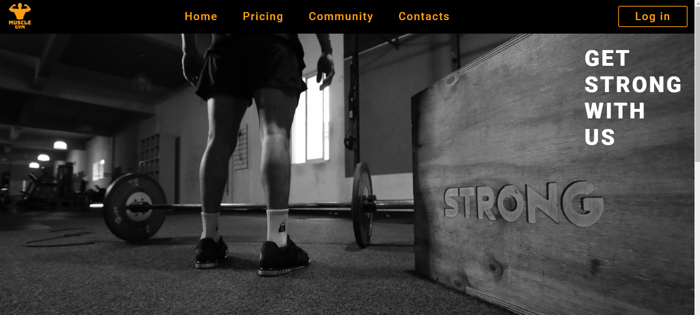
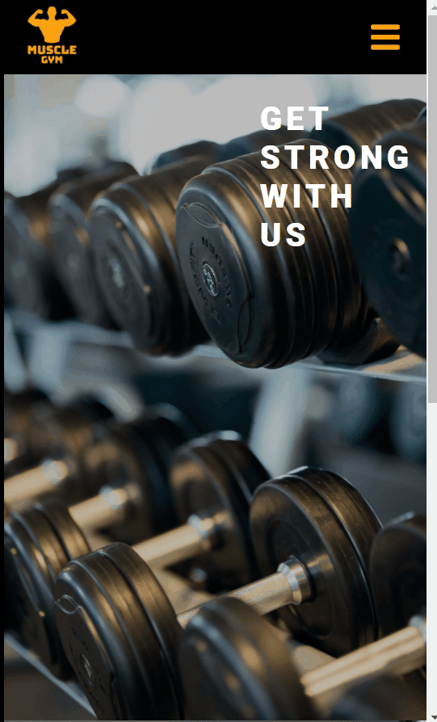
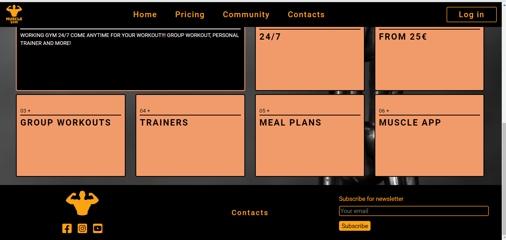
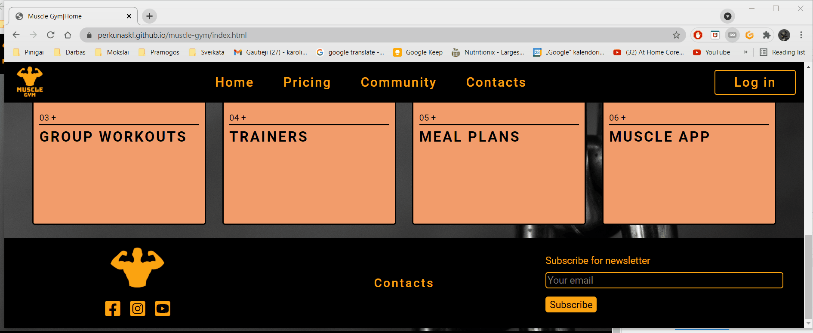

# Muscle Gym Live - Testing 

[Main README.md file](/README.md)

[View live project](https://perkunaskf.github.io/muscle-gym/index.html)

[View website in GitHub Pages](https://github.com/PerkunasKF/muscle-gym)

***
## Table of contents
1. [Testing User Stories](#Testing-User-Stories)
2. [Manual Testing](#Manual-Testing)
3. [Automated Testing](#Automated-Testing) 
     - [Code Validation](#Code-Validation)
     - [Browser Validation](#Browser-Validation)
     - [Lighthouse Auditing](#Lighthouse-Auditing)
4. [User Testing](#User-Testing)

***

## Testing User Stories

#### New/Potential clients:
1. As a new client, I want to easily navigate through the website to find the relevant content, effortlessly.

     - The navigation bar clearly separates because of the color scheme and is easy to use.
     - The logo image on the top left edge of each page leads users back to the home page.
     - The footer links, button and forum are easy to use and distinguish.
     - All icons, links, buttons and logos react to hover effect to easily understand that they have a reaction.

2. As a new client, I want to learn more about the gym in order to know if it can supply me with desired services.

     - The home page has a feature section to see what gym can provide.
     - Pricing page has membership and group training section clearly defined and give all needed information.

3. As a new client, I want to easily navigate to the gym's social links in order to keep up with the latest news and events.

     - Community page has a news section to find out about all news and events at the gym.
     - Community page has a gallery section to view what take place in the gym and what equipment it filters.

#### Current Clients Goals:
1. As a current client, I want to easily find out about upcoming events so I can book a place.

     - Community page has a news section to find out about all the news and events at the gym.
     - Footer features a news subscription form to subscribe to news about the gym.

2. As a current client, I want to easily log in to my membership account to manage my membership.

     - Header feature a **Log In** button to login members to their gym account.

[Back to top ⇧](#Muscle-Gym)

## Manual Testing
Manual testing was done on page elements that appear on every page:

- Hover over header element will trigger a visual response.

     
     
- On a small screen, clicking on a **toggle** icon will open drop down links, hovering over them will trigger a visual response.

     
     
- Hovering over the footer element will trigger a visual response.
- Clicking on contacts button will open a dropdown menu, hearing over menu items will trigger a visual response.
- Clicking forum elements will trigger a visual response, not entering email address will trigger a recorded message.

     
     
- Clicking on social media link icons in the footer will open them in a separate tab

     
     
### Home page

- A feature section on the home page will compress into a carousel on small screen sizes.
- Navigating true the carousel is possible with control buttons.

     

- Home page responsiveness.
     
     
     

## Automated Testing

### Code Validation

### Browser Validation

### Lighthouse Auditing

## User testing 
